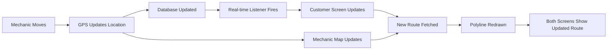

# 🗺️ Polyline Route - Quick Visual Guide

## 📱 Mechanic's View

```
┌─────────────────────────────────────┐
│  🗺️ Job Tracking Bottom Sheet      │
├─────────────────────────────────────┤
│                                     │
│     🚗 (You)                       │
│      ╲                             │
│       ╲ ←─ Red Route Line          │
│        ╲    (Follows Roads)        │
│         ╲                          │
│          ╲                         │
│           ▼                        │
│          📍 (Customer)             │
│                                     │
│  Distance: 2.5 km                  │
│  ETA: 8 minutes                    │
│                                     │
│  [Start Navigation] [Call Customer] │
└─────────────────────────────────────┘
```

**Features:**
- ✅ Shows YOUR location (🚗)
- ✅ Shows CUSTOMER location (📍)
- ✅ Red route line from you to customer
- ✅ Route follows actual roads
- ✅ Updates as you move

---

## 📱 Customer's View

```
┌─────────────────────────────────────┐
│  🗺️ Service Tracking Bottom Sheet  │
├─────────────────────────────────────┤
│                                     │
│     🔧 (Mechanic)                  │
│      ╲                             │
│       ╲ ←─ Red Route Line          │
│        ╲    (Shows Mechanic Path)  │
│         ╲                          │
│          ╲                         │
│           ▼                        │
│          📍 (Your Location)        │
│                                     │
│  Mechanic: Juan Dela Cruz          │
│  Distance: 2.5 km away             │
│  Arriving in: 8 minutes            │
│                                     │
│  [Call Mechanic] [Cancel Request]  │
└─────────────────────────────────────┘
```

**Features:**
- ✅ Shows MECHANIC location (🔧)
- ✅ Shows YOUR pickup location (📍)
- ✅ Red route line from mechanic to you
- ✅ Route updates in real-time as mechanic moves
- ✅ See mechanic getting closer

---

## 🎨 Route Styles

### Normal Route (Google Maps API)
```
Mechanic 🚗━━━━━━━━━━━━━━━━▶ 📍 Customer
         ╰─ Solid Red Line
         ╰─ Follows actual roads
         ╰─ Width: 6px
         ╰─ Color: #B00C01
```

### Fallback Route (No Internet)
```
Mechanic 🚗┅┅┅┅┅┅┅┅┅┅┅┅┅┅┅▶ 📍 Customer
         ╰─ Dashed Orange Line
         ╰─ Straight line
         ╰─ Width: 4px
         ╰─ Appears when offline
```

---

## 🔄 Real-Time Updates

### Mechanic Moving:

```
Time: 10:00 AM
┌─────────────────────┐
│  🚗                 │  Mechanic at Point A
│   ╲                │
│    ╲               │
│     📍             │
└─────────────────────┘

Time: 10:01 AM (Mechanic moves)
┌─────────────────────┐
│                     │
│     🚗              │  Mechanic moved closer
│      ╲             │  Route automatically
│       📍           │  updates!
└─────────────────────┘

Time: 10:02 AM (Mechanic arrives)
┌─────────────────────┐
│                     │
│                     │
│        🚗📍         │  Mechanic reached
│     (Arrived!)      │  customer location
└─────────────────────┘
```

---

## 📊 Update Frequency

### Mechanic's View:
```
GPS Update → Every 5-10 seconds
   ↓
Route Refresh → Automatic
   ↓
Map Updates → Smooth animation
```

### Customer's View:
```
Mechanic Moves → Updates database
   ↓
Real-time Listener → Fires immediately
   ↓
Route Refresh → Automatic
   ↓
Map Updates → Smooth animation
   ↓
Customer Sees → Mechanic getting closer
```

---

## 🎯 Use Cases

### 1. Customer Tracking Mechanic
```
Customer: "Where is my mechanic?"
App: Shows mechanic location + red route
Customer: "Oh, he's 2 km away, coming down Main St!"
```

### 2. Mechanic Navigating to Customer
```
Mechanic: "How do I get to customer?"
App: Shows customer location + red route
Mechanic: "I need to take Highway 1, then turn at Oak St"
```

### 3. Real-Time Progress
```
Customer watches:
- Mechanic starts 10 km away
- Route shows → 8 km... 5 km... 2 km...
- ETA updates → 20 min... 15 min... 5 min...
- Mechanic arrives! 🎉
```

---

## 🚨 What You See

### ✅ Good Network (Normal):
- **Solid RED route** (RoadAid color)
- Route follows actual roads
- Smooth updates
- Accurate ETA

### ⚠️ Poor Network (Fallback):
- **Dashed ORANGE route**
- Straight line between points
- Still shows distance
- Less accurate ETA

---

## 📱 Screenshots Locations

### To Find in App:

**Mechanic:**
1. Accept a job
2. Bottom sheet appears at bottom
3. Map shows with route to customer

**Customer:**
1. Request service
2. Wait for mechanic assignment
3. Bottom sheet appears at bottom
4. Map shows with route from mechanic

---

## 🎨 Color Legend

| Element | Color | Meaning |
|---------|-------|---------|
| 🚗 Red Marker | Red | Mechanic location |
| 📍 Blue Marker | Blue | Customer location |
| ━━━ Red Line | #B00C01 | Active route (with API) |
| ┅┅┅ Orange Line | Orange | Fallback route (no API) |
| 🟢 Green Circle | Green | Mechanic available |
| 🔴 Red Circle | Red | Mechanic busy |

---

## ⚡ Quick Facts

- ✅ **Both views see the same route** (just from different perspectives)
- ✅ **Route updates automatically** when mechanic moves
- ✅ **Works offline** with fallback straight-line route
- ✅ **Follows real roads** using Google Directions API
- ✅ **Smooth animations** for better user experience
- ✅ **Accurate ETAs** based on traffic and distance

---

## 🔧 Technical Flow



---

## 📝 Summary

**What it does:**
- Shows real-time route between mechanic and customer
- Updates automatically as mechanic moves
- Works on both mechanic and customer screens
- Uses Google Maps for accurate routing

**Why it's useful:**
- Mechanic knows which way to go
- Customer sees mechanic's progress
- Better transparency and trust
- Improved service experience

**How to use:**
1. Mechanic accepts job → sees route to customer
2. Customer waits → sees route from mechanic
3. Both watch route update in real-time
4. Mechanic arrives → service begins

---

**Status:** ✅ Fully Implemented & Ready to Test
